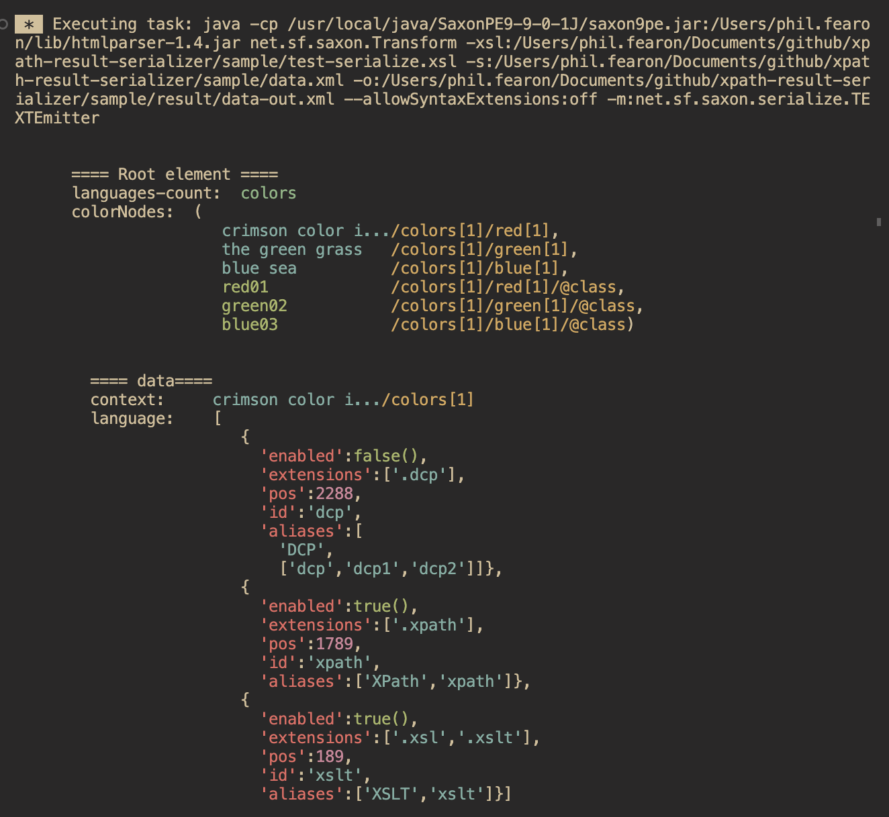

# XPath Result Serializer

A standard XSLT module intended to help with XSLT/XPath debugging in combination with the `xsl:message` instruction and `trace()` function.

Using two XSLT functions, `print()` and `println()`, the result of an XPath expression is converted to a notation similar to JSON.

> **Note:** The standard *fn:serialize()* function, using the 'adaptive' output method, provides similar functionality:<br>
> `fn:serialize($n, map{'method':'adaptive'})`<br>
> The XSLT functions here simply provide more extensibility for features such as coloring and indentation 

---
### Sample Usage
```xml
    <xsl:message expand-text="yes">
      ==== Root element ====
      languages-count:  {node-name() => ext:print(9,'  ')}
      colorNodes:  {ext:print((*,*/@*),9,'  ')}
      
    </xsl:message>
    <xsl:copy>    
      <xsl:message expand-text="yes">
        ==== data====
        context:     {ext:print(.,10,'  ')}
        language:    {ext:print($langItems,10,'  ')}
      </xsl:message>
```


Screenshot from the xsl:message output shown above in the VS Code terminal using `ext:print()` and `ext:println()`:



## Key Resource Files
- Source XSLT: `src/xpath-result-serializer.xsl`
- Sample: `sample/test-serializer.xsl`

## Colorising of xsl:message Output with Saxon

If a Saxon version prior to `9.9.0.1` is detected, ANSI codes are included in the outputs of `ext:print()` and `ext:println()` to provide colorisation (see screenshot).

These ANSI would normally escaped as XML character references in the result. In SaxonJ, prior to v9.9.0.2, the command-line option `-m:net.sf.saxon.serialize.TEXTEmitter` can be used to prevent this XML escaping so xsl:message colors can be seen as intended.

To prevent escaping of ANSI codes with the Saxon API - see the Saxon [Message Output Documentation](https://www.saxonica.com/documentation12/index.html#!using-xsl/stylesheet-output/message-output).