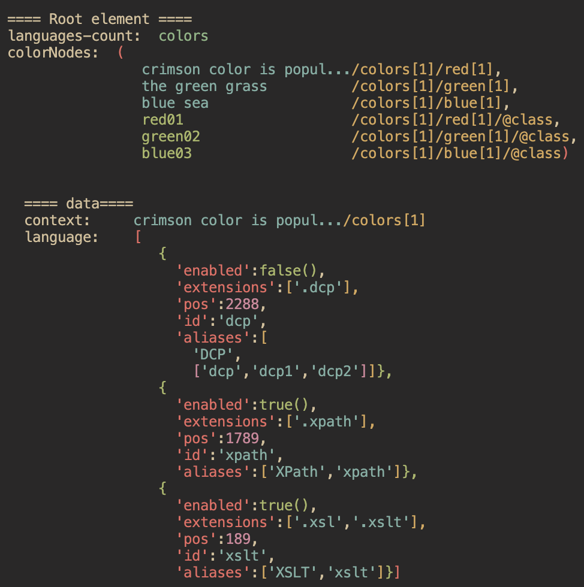

# XPath Result Serializer

Intended for XSLT/XPath debugging in combination with the `xsl:message` instruction and `trace()` function.

Converts the result of an XPath expression to a notation similar to JSON.

## Main differences from JSON:

1. XPath sequences are represented with parenthesis like: '(1,2,3,4)'
2. Map keys are enclosed in single-quotes and then only if they are of type xs:string
3. Atomic values are enclosed in single-quotes but then only if they are of type xs:string
4. Boolean values are represented as: true() and false()
5. Nodes are represented by XPath locations - namespace-prefixes are used in the location if declared on the context root element
6. No JSON escaping

### Sample xsl:message output
The xsl:message output to the VS Code terminal using `ext:print()` and `ext:println()`:

## Key Resource Files
- Source XSLT: `src/xpath-result-serializer.xsl`
- Sample: `sample/test-serializer.xsl`